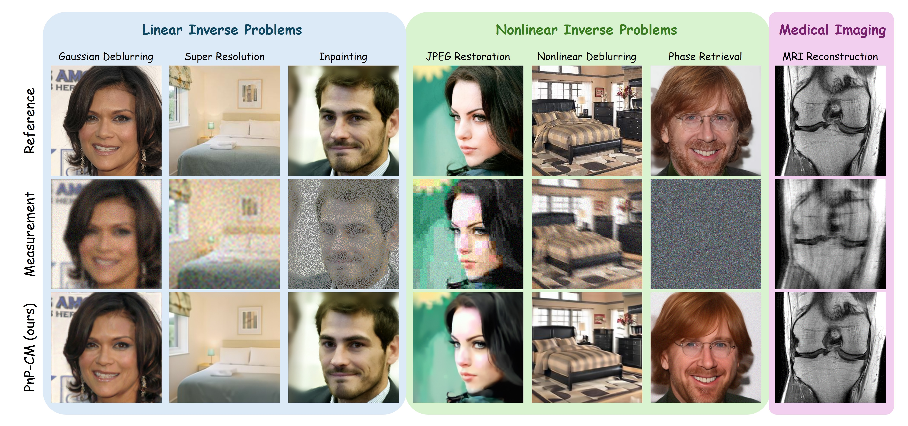

# PnP-CM: Consistency Models as Plug-and-Play Priors for Inverse Problems (CVPR 2026) #
[](https://arxiv.org/pdf/2509.22736)

[Merve Gulle](https://scholar.google.com/citations?user=Pmu-yJYAAAAJ&hl=en), [Junno Yun](https://scholar.google.com/citations?user=Ou4ff9kAAAAJ&hl=en&oi=ao), [Yasar Utku Alcalar](https://scholar.google.com/citations?user=9N2YMjEAAAAJ&hl=en&oi=ao), [Mehmet Akcakaya](https://scholar.google.com/citations?user=x-q3XC4AAAAJ&hl=en&oi=ao), University of Minnesota
<p align="center">
  
</p>


# Installation #

### 1. Clone This Repository

```bash
git clone https://github.com/MerveGulle/PnP-CM.git
```

### 2. Create Conda Environment and Install Requirements

```bash
conda create -n {env_name} python=3.12
conda activate {env_name}

cd CM-RED
pip install requirements.txt
```

### 3. Pre-trained CM Models

We provide pre-trained CM models for the **CelebA-HQ** and **fastMRI knee** datasets. \
For **LSUN Bedroom**, we used the official pre-trained Consistency Models provided by OpenAI in the [CM repo](https://github.com/openai/consistency_models?tab=readme-ov-file#pre-trained-models).\

#### CelebA-HQ
Pre-trained CM model is available at the following [link](https://www.dropbox.com/scl/fo/l5q06udyq1zbg2rhjbvvm/AFSAMaZbHmJNG1Nd1qyJ-Ko?rlkey=h2np6dpba8tnnv3pc66ew5o7x&dl=0). \
Please download and place the pre-trained models under: `./exp/logs/celeba_hq/`

#### LSUN Bedroom
Pre-trained CM model is available at the following [link](https://openaipublic.blob.core.windows.net/consistency/cd_bedroom256_lpips.pt). \
Please download and place the pre-trained models under: `./exp/logs/lsun_bedroom/`

#### Fast MRI (knee)
Pre-trained CM model is available at the following [link](https://www.dropbox.com/scl/fo/l5q06udyq1zbg2rhjbvvm/AFSAMaZbHmJNG1Nd1qyJ-Ko?rlkey=h2np6dpba8tnnv3pc66ew5o7x&dl=0). \
Please download and place the pre-trained models under: `./exp/logs/fast_mri/`

### 4. Set up Nonlinear Deblurring
We use the external codes for non-linear deblurring. Please clone the following repo under the main directory:
```bash
git clone https://github.com/VinAIResearch/blur-kernel-space-exploring bkse
```

### 5. Set up JPEG Compression
We use the external codes for differentiable JPEG compression. Please clone `diff_jpeg` folder the following repo under: `./functions/`
```bash
cd functions
git clone --depth 1 --filter=blob:none --sparse https://github.com/necla-ml/Diff-JPEG.git
cd Diff-JPEG
git sparse-checkout set diff_jpeg
mv diff_jpeg ../
cd ..
rm -rf Diff-JPEG
cd ..
```

### 6. Datasets

#### CelebA-HQ
You can download the CelebA-HQ dataset that we used for validation in the paper from this [link](https://drive.google.com/drive/folders/1RBK-ikwjddi24gotrlg2XdJUoBFnhHs3?usp=drive_link).
Please place the dataset under `./exp/datasets/celeba_hq/celeba_hq`

#### LSUN Bedroom
You can download the bedroom dataset that we used for validation in the paper from this [link](https://drive.google.com/drive/folders/1fTmt6-o03KmaFmz32rd44QoOI43m8IVG?usp=drive_link).
Please place the dataset under: `./exp/datasets/lsun_bedroom/bedroom`

#### Fast MRI knee
Please download the **fastMRI** dataset from [fastMRI](https://fastmri.med.nyu.edu/) after agreeing to the data use agreement.

We use the `knee_multicoil_val` validation sets for evaluation. 

Coil sensitivity maps are generated using the `sigpy.mri.app.EspiritCalib` function.

The preprocessed dataset should be placed under:

```bash
./exp/datasets/fastMRI/
├── PD
├── PDFS
```

Make sure the preprocessed files are in **.mat format** and contain the following keys:

```python
# k-space data
kspace  # shape: (C, H, W)

# coil sensitivity maps
coils   # shape: (C, H, W)
```

`./datasets/fast_mri.py` loads the raw k-space data and the corresponding coil sensitivity maps.


## Quick Start

#### Supported degradations in this repository:

- `deblur_gauss`   : Gaussian deblurring
- `inpainting`     : Random inpainting (70%)
- `sr_bicubic`     : Bicubic super-resolution (x4)
- `deblur_nl`      : Non-linear deblurring
- `jpeg`           : JPEG compression with quality factor (QF) 5
- `phase_retrieval`: Phase retrieval

Use the following commands to generate PnP-CM results:

#### CelebA-HQ
```bash
python main.py --deg={degradation} --path_y='celeba_hq' --sigma_y=0.05 --config='celeba_hq_256.yml' --model_ckpt='celeba_hq/ema_0.9999432189950708_1175000.pt' --save_y
```
#### LSUN Bedroom
```bash
python main.py --deg={degradation} --path_y='bedroom' --sigma_y=$sigma_y --config='lsun_bedroom_256.yml' --model_ckpt='lsun_bedroom/cd_bedroom256_lpips.pt' --save_y
```
#### Fast MRI knee
```bash
python main.py --deg='fastmri' --path_y={path_y} --acc_rate=4 --acs_lines=24 --us_pattern=gaussian1d --sigma_y=0.0 --config='fastmri_320.yml' --model_ckpt=fast_mri/ema_0.9999432189950708_700000_cm_knee.pt --save_y
```

#### Hyperparameters:
The method uses a small set of hyperparameters that control the sampling trajectory and an inner optimization loop (for nonlinear problems).

We provide the hyperparameters used in the main paper for CelebA-HQ and FastMRI experiments under `./task_specific_args`, which are automatically loaded by the code. 

For other tasks or custom configurations, the following hyperparameters can be adjusted:
##### Sampling / noise schedule
- `iN`        : Initial noise level
- `gamma`     : Noise level decay rate
- `deltas`    : A comma separated list of the delta hyperparameters, sigma_cm[n]=sigma[n]*(1+delta[n])
- `rhos`      : A comma separated list of the rho hyperparameters, penalty parameters
- `mu_0`      : Initial momentum
- `T_sampling`: Number of iterations / NFEs

##### Optimization parameters (nonlinear inverse problems only)
- `opt_type`       : Optimization type, 'Adam', 'SGD', etc.
- `opt_lr`         : Learning rate
- `opt_num_iter`   : Number of iterations
- `opt_decay_rate` : Decay rate of the learning rate


## Acknowledgements

This codebase is mainly built upon [CM4IR](https://github.com/tirer-lab/CM4IR) repository.

## 📝 Citation
If you find this repository useful in your research, please consider citing our work:
```bibtex

@inproceedings{gulle2026_CVPR,
  title     = {{PnP-CM}: {C}onsistency models as plug-and-play priors for inverse problems},
  author    = {G{\"u}lle, Merve and Yun, Junno and Al{\c{c}}alar, Ya{\c{s}}ar Utku and Ak{\c{c}}akaya, Mehmet},
  booktitle = {Proc. IEEE/CVF Conf. Comput. Vis. Pattern Recog.},
  year      = 2026,
}

```
